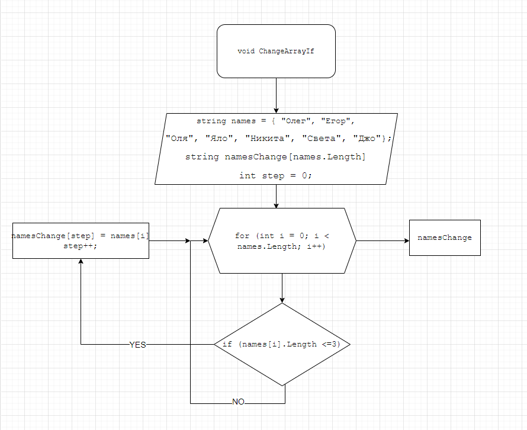

# Контрольная работа

## Задача
>Написать программу, которая из имеющегося массива строк, формирует массив из строк, длина которых меньше, либо равна 3 символа. Первоначальный массив можно ввести с клавиатуры, либо задать на старте выполнения алгоритма. При решении, не рекомендуется пользоваться коллекциями, лучше обойтись исключительно массивами.

### Ход выполнения задачи

1. Объявляем два массива. Второй необходимо задать такой же длины, что и первый.
2. Формируем метод (ChangeArrayIf), в котором цикл, соразмерный длине массива, внутри цикла проверяет условие ( <= 3 ). При условии выполнения - элемент первого массива заносится в "step" как элемент второго массива.
3. "step" - необходима для поочередной записи элементов массива, которые соответствуют условиям, заданным в пункте 2.
4. Для выполнения цикла переменная "step" увеличиватся на 1, а затем возвращается в циклу "for", в котором "i" увеличивается на 1.
5. Цикл повторяется, пока элементы в массиве не закончатся.
6. Затем при помощи метода (PrintArray), выводим новосозданный массив на экран.

**Блок-схема основного void - ChangeArrayIf, представлена ниже.**

